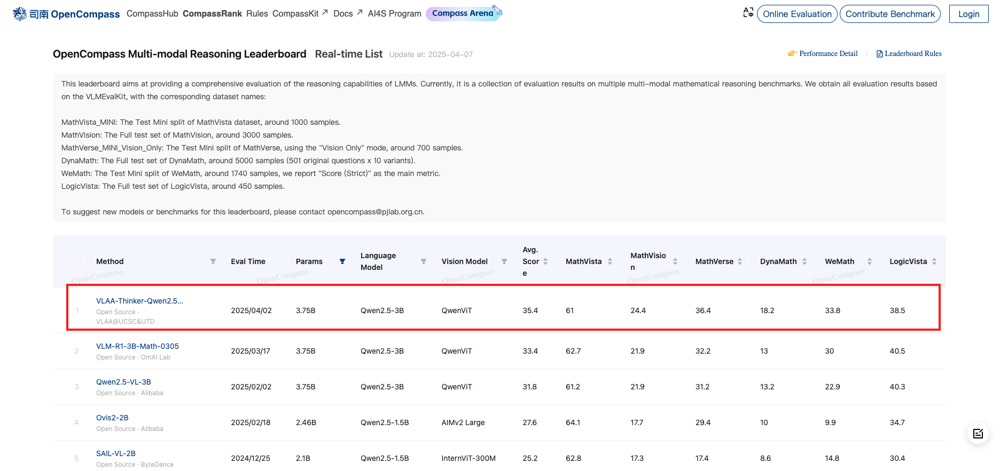
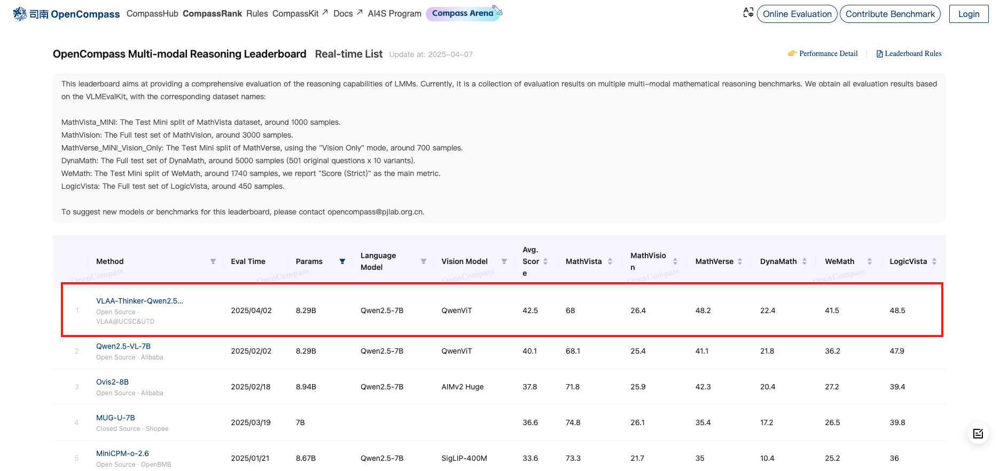
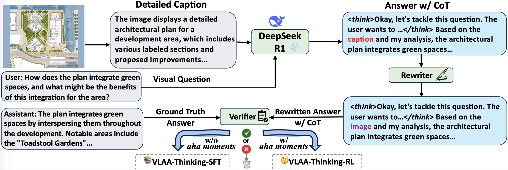

# SFT or RL? An Early Investigation into Training R1-Like Reasoning Large Vision-Language Models


<p align="center">
  🌐 <a href="https://ucsc-vlaa.github.io/VLAA-Thinking/" target="_blank">Project Page</a>  
  • 
  <a href="./assets/VLAA-Thinker.pdf" target="_blank">Arxiv</a>  
  • 💻  <a href="https://github.com/UCSC-VLAA/VLAA-Thinking" target="_blank">Code</a>  

</p>

<p align="center">
  
  <a href="https://huggingface.co/collections/UCSC-VLAA/vlaa-thinker-67eda033419273423d77249e" target="_blank">VLAA-Thinker Family</a>  
  • 🤔 <a href="https://huggingface.co/datasets/UCSC-VLAA/VLAA-Thinking" target="_blank">VLAA-Thinking Dataset</a>  
  <!-- •   
  <a href="https://huggingface.co/UCSC-VLAA/VLAA-Thinker-Qwen2VL-7B-Zero" target="_blank">VLAA-Thinker-Qwen2VL-7B-Zero</a>    -->

</p>

<p align="center">
  
  <a href="https://huggingface.co/UCSC-VLAA/VLAA-Thinker-Qwen2.5VL-3B" target="_blank"><b>VLAA-Thinker-Qwen2.5-3B</b></a>   
  •   
  <a href="https://huggingface.co/UCSC-VLAA/VLAA-Thinker-Qwen2.5VL-7B" target="_blank"><b>VLAA-Thinker-Qwen2.5-7B</b></a>   
</p>


<!-- <p align="center">
  
  <a href="https://huggingface.co/UCSC-VLAA/VLAA-Thinker-Qwen2VL-2B" target="_blank">VLAA-Thinker-Qwen2VL-2B</a>   
  •   
  <a href="https://huggingface.co/UCSC-VLAA/VLAA-Thinker-Qwen2VL-7B-Zero" target="_blank">VLAA-Thinker-Qwen2VL-7B-Zero</a>   
  •   
  <a href="https://huggingface.co/UCSC-VLAA/VLAA-Thinker-Qwen2VL-7B" target="_blank">VLAA-Thinker-Qwen2VL-7B</a>   
</p> -->
Both **VLAA-Thinker-Qwen2.5-3B** and **VLAA-Thinker-Qwen2.5-7B** achieve **SOTA** performance on [OpenCompass Multimodal Reasoning Leaderboard](https://rank.opencompass.org.cn/leaderboard-multimodal-reasoning/?m=REALTIME) as of April 7th, 2025.


-----




## Contents
- [Quick Start 🚀](#quick-start-🚀)
- [Dataset Generation Pipeline 🏭](#vlaa-thinking-data-generation-🏭)
- [Dataset Card 📚](#dataset-card-📚)
- [Examples 📝](#examples-📝)
- [Contributors 🙌](#contributors-🙌)


## Quick Start 🚀
### Inference
Run `python inference.py`. Note that our model is trained with a system prompt. Please ensure that it is included for inference.


### Dataset Download
Run `bash ./utils/download_dataset.sh`. Specify the dataset root with absolute path. The dataset should be ordered as follows:
```
├── train-grpo.json
├── train-sft.json
└── images
    ├── allava_laion
    ├── arxivqa
    ├── chartqa
    ├── clevr_math
    ├── coco
    │   └── train2017
    ├── docvqa
    ├── geoqa170k
    ├── synthesis
    ├── vg
    │   ├── VG_100K
    │   └── VG_100K_2
    └── vizwiz
```
### Training
Code coming soon!


## VLAA-Thinking Data Generation 🏭


<details> <summary><strong>Step 1: Metadata Collection</strong></summary>
We gather metadata from 9 distinct vision-language datasets, each comprising either closed- or open-ended visual questions. Unique images are sampled and processed through our comprehensive pipeline from datasets including CLEVR-Math, Math PUMA, ArxivQA, DocVQA, VizWiz, and ALLaVA. We directly utilize COCO and VisualGenome data as provided by LLaVA-CoT. Note that GeoQA170K is included exclusively in the RL dataset due to captioning hallucination challenges. Dataset statistics are summarized in the provided table.

</details> 

<details> <summary><strong>Step 2: Visual Captioning and Additional Context</strong></summary>
Each datapoint begins with an image-question-answer triplet. To effectively connect visual content with textual reasoning, we generate detailed, structured captions for each image using GPT-4o. Additionally, we leverage dataset-specific annotations to enrich the visual understanding: CLEVR-Math includes scene synthesis instructions, Math PUMA provides descriptive textual math problems, and ALLaVA-LAION offers carefully verified GPT-4V captions (prompt [here](assets/prompts/1.captioning.txt)).

</details>

<details> <summary><strong>Step 3: Reasoning Answer Distillation</strong></summary>
Utilizing the text-only reasoning model DeepSeek-R1, we generate structured and logical reasoning steps alongside final answers. The model reasons based on image captions, visual questions, and supplementary dataset-specific information, outputting a step-by-step rationale enclosed by explicit <think> tags for clarity (prompt [here](assets/prompts/2.r1cot.txt)).

</details> 

<details> <summary><strong>Step 4: Answer Refinement and Rewriting</strong></summary>
To ensure clarity, consistency, and modality independence, we refine the reasoning outputs through a rewriting module powered by GPT-3.5-turbo. This refinement removes unnecessary modality-specific phrases and standardizes the answers. Samples exhibiting large textual deviations post-rewriting (more than 15 words difference) are filtered out to preserve minimal textual alteration (prompt [here](assets/prompts/3.rewrite.txt)).

</details> 

<details> <summary><strong>Step 5: Automated Verification</strong></summary>
We verify the rewritten answers against the original ground-truth answers through an automated validation module. Only samples with verified correct answers are retained in the final training set, ensuring accuracy and logical coherence (prompt [here](assets/prompts/4.verify.txt)).

</details> 

<details> <summary><strong>Step 6: Curating Data Splits for SFT and RL</strong></summary>
We partition the dataset into two mutually exclusive subsets tailored specifically for supervised fine-tuning (SFT) and reinforcement learning (RL). Following insights from recent studies highlighting RL's strength in deeper reasoning challenges, we use explicit self-reflective cues (termed "aha moments") in reasoning as a proxy for difficulty. Simpler examples without these cues populate the SFT set, while more challenging examples containing reflective "aha moments" form the dedicated RL dataset.

</details>


<!-- ### Captioning
To enable the text-only R1 model to understand visual content, we need a detailed caption for each image. In our experiments: 
1) For datasets with captions included (ALLaVA), we use the original captions;
2) For datasets containing *textual questions* that are equivalent to *image + visual questions* (Synthesis), we skip this step.
3) For the remaining datasets (CLEVR-Math, ArxivQA, GeoQA170K) which only contain images and VQAs, we generate a detailed caption for each image with **GPT-4o** (prompt [here](assets/prompts/1.captioning.txt)).  -->

<!-- ### Visual-Language CoT Generation
In this step, we generate the Vision-Language CoT data from **R1**.
1) For datasets with textual questions (Synthesis), we prompt R1 with only the textual questions without any additional instructions/information. 
2) For the other datasets, we prompt R1 with a caption and its associated visual question. We also intruct R1 not to output terms like "based on the caption" in its response because there's no caption presented during visual instruction tuning (prompt [here](assets/prompts/2.r1cot.txt)). -->


<!-- ### Answer Rewriting
After obtaining answers with CoT from R1, we observe that some answers contain undesired expressions, despite R1 instructed not to do so. 
Therefore, we use **GPT-4o** as a content rewriter to fix the errors while keeping everything else unchanged (prompt [here](assets/prompts/3.rewrite.txt)).  -->


<!-- ### Answer Verification
The last step is to verify the correctness of generated responses. We leverage **GPT-3.5-Turbo** to compare the generated content with groundtruth from the original dataset (prompt [here](assets/prompts/4.verify.txt)). -->


## Dataset Card 📚


| Name | Data Type | # Original | # Pipeline | # Final SFT | **# Final RL** |
| --- | --- | --- | --- | --- | --- |
| <a href="https://huggingface.co/datasets/lmms-lab/LLaVA-OneVision-Data/tree/main/CLEVR-Math(MathV360K)" target="_blank">CLEVR_Math</a> | Closed-end | 35,000 | 28,018 | 5,923 | **2,000** |
| <a href="https://huggingface.co/datasets/lmms-lab/LLaVA-OneVision-Data/tree/main/geo170k(qa)" target="_blank">GeoQA170K</a> | Closed-end | - | - | - | **6,499** |
| <a href="https://huggingface.co/datasets/Math-PUMA/Math-PUMA_Data_Stage2/tree/main/Synthesis" target="_blank">Math PUMA</a> | Closed-end | 30,000 | 26,672 | 19,258 | **6,696** |
| <a href="https://huggingface.co/datasets/MMInstruction/ArxivQA?row=0" target="_blank">ArxivQA</a> | Closed-end | 54,399 | 51,348 | 34,604 | **1,000** |
| <a href="https://www.docvqa.org/datasets" target="_blank">DocVQA</a> | Closed-end | 10,194 | 8,206 | 4,897 | **1,000** |
| <a href="https://vizwiz.org/tasks-and-datasets/vqa/" target="_blank">VizWiz</a> | Closed-end | 20,523 | 6,528 | 4,266 | **1,000** |
| <a href="https://huggingface.co/datasets/FreedomIntelligence/ALLaVA-4V/tree/main/allava_laion" target="_blank">ALLaVA-LAION</a> | Open-end | 47,066 | 18,123 | 10,496 | **3,000** |
| <a href="https://huggingface.co/datasets/Xkev/LLaVA-CoT-100k" target="_blank">LLaVA-CoT-COCO</a> | Closed-end | 3,000 | 3,000 | 8,727 | **2,000** |
| <a href="https://huggingface.co/datasets/Xkev/LLaVA-CoT-100k" target="_blank">LLaVA-CoT-VisualGenome</a> | Closed-end | 3,000 | 3,000 | 38,242 | **2,000** |
| Total | Closed- & Open-end | 203,182 | 144,895 | 126,413 | **25,195** |


**Data statistics of VLAA-Thinking**. We present the original volume of metadata (<span>#Original</span>), the data size after the distillation pipeline (<span>#Pipeline</span>), the size of sampled examples for SFT (<span>#Final SFT</span>) and RL (<span>#Final RL</span>), respectively. Note that we only use GeoQA170K with verifiable answers for the RL split.


## Examples 📝


<details><summary>CLEVR-Math</summary>


```plaintext
{
    "id": "clevr_math-CLEVR_train_027977.png",
    "image": "clevr_math/CLEVR_train_027977.png",
    "question": "Subtract all balls. How many objects are left?",
    "gt": 3,
    "ds_answer": "<think>  \nOkay, let's see. The user is asking to subtract all balls and determine how many objects are left. First, I need to figure out which objects are considered \"balls\" in the image. The image shows a large blue metal sphere. A sphere is a three-dimensional circle, which is essentially a ball shape. So the blue metal sphere is definitely a ball.  \n\nNext, the surrounding objects are two small red metal cylinders and a single small brown metal cylinder in the foreground. Cylinders are not balls; they have a different shape—circular bases and straight sides. So those would not be subtracted. The question says to subtract all balls, so only the sphere (ball) needs to be removed.  \n\nOriginally, there's the sphere (1 object), two red cylinders (2 objects), and one brown cylinder (1 object). Total objects before subtraction: 1 + 2 + 1 = 4. Subtracting the one ball leaves 3 objects: the two red cylinders and the brown cylinder.  \n\nWait, but I should make sure there are no other balls mentioned. The image only refers to the sphere as a ball-like object. The cylinders are clearly not balls. So subtracting the sphere leaves three cylinders. The answer should be 3.  \n</think>  \n\nIn the scene, there is one large blue sphere (a ball-shaped object) centrally positioned. The remaining objects consist of two small red cylinders flanking it symmetrically and a single brown cylinder in the foreground. Removing the sphere leaves only the three cylindrical objects visible.  \n\n**Answer:** There are 3 objects remaining.  ",
    "caption": "The image depicts an indoor setting with a smooth, neutral-colored surface background. Positioned centrally is a large blue metal sphere with a glossy finish, reflecting slight highlights. Surrounding it are two small red metal cylinders placed symmetrically on either side, also showing a metallic sheen. In the foreground, a single small brown metal cylinder is situated, completing the arrangement. The metals' shiny surfaces create a play of subtle reflections and shadows on the even surface beneath.",    "meta": {
        "caption_model_id": "gpt-4o-0806-nofilter-global",
        "rationale": "There are a large blue metal sphere, a small red metal cylinder, a small red metal cylinder, a small brown metal cylinder in the image."
    }
}
```
</details>


<details><summary>GeoQA</summary>


```plaintext
{
    "id": "geoqa170k-geoqa_plus-2905-63590",
    "image": "geoqa170k/geoqa_plus-2905.png",
    "question": "Given a semicircular figure with the diameter represented by AB and intersecting chords AD and BC at point P, where angle DPB measures 60.0 degrees, calculate the value of tan(angle ADC) under the condition that D denotes the midpoint of the arc BC.\nChoices:\nA: \frac{1}{2}\nB: 2\nC: \frac{√{3}}{3}\nD: √{3}",
    "gt": "C",
    "ds_answer": "<think>\nOkay, so I'm trying to solve this geometry problem. Let me see if I can visualize it correctly. There's a semicircle with diameter AB. Points C and D are on the curved edge, and chords AC and BD intersect at point P. Below AB, there's the center O. The angle DPB is 60 degrees, and D is the midpoint of arc BC. I need to find the value of tan(angle ADC).\n\nFirst, I should probably draw this out to get a better sense. I imagine a semicircle with AB as the diameter. O is the center, so AO = OB. Points C and D are on the semicircle, with D being the midpoint of arc BC. That means arc BD is equal to arc DC. Since it's a semicircle, the total arc from B to C is 180 degrees, so each arc BD and DC would be 90 degrees each. Wait, no, because D is the midpoint of arc BC, which is part of the semicircle. So if BC is some arc, D is halfway along it. But I'm not sure about the exact measure yet.\n\nChords AC and BD intersect at P, and angle DPB is 60 degrees. I remember that when two chords intersect, the products of the segments are equal. So AP * PC = BP * PD. But I'm not sure if that's directly useful here.\n\nSince D is the midpoint of arc BC, it might have some special properties. In a semicircle, the midpoint of an arc would be equidistant from B and C. Also, angles subtended by the same arc are equal. Maybe I can use some properties of cyclic quadrilaterals here, but since it's a semicircle, all points lie on the circumference, so ABCD is a cyclic quadrilateral.\n\nWait, but ABCD is a quadrilateral inscribed in a semicircle, which makes it a cyclic quadrilateral. In such cases, opposite angles sum to 180 degrees. But I'm not sure if that's applicable here because we're dealing with a semicircle, not a full circle.\n\nLet me think about the angles. Angle DPB is 60 degrees. Since P is the intersection of chords AC and BD, maybe I can use the property that the angle between two chords is equal to half the sum of the measures of the intercepted arcs. So angle DPB would be half the sum of arcs DB and AC. But I'm not sure about the exact arcs involved.\n\nAlternatively, maybe I can use triangle properties. Since D is the midpoint of arc BC, triangle DBC might be isosceles. Wait, no, because D is on the semicircle, so triangle DBC is actually a right triangle because any triangle inscribed in a semicircle is a right triangle. So angle BDC is 90 degrees.\n\nWait, that's an important point. Since D is on the semicircle, triangle BDC is right-angled at D. So angle BDC is 90 degrees. That might help in finding angle ADC.\n\nI need to find tan(angle ADC). Let's denote angle ADC as θ. So tan(θ) = opposite/adjacent. To find this, I might need to find the lengths of the sides of triangle ADC or use some trigonometric identities.\n\nLet me consider the coordinates approach. Let's place the semicircle on a coordinate system with center O at (0,0), and AB as the diameter along the x-axis from (-r,0) to (r,0), where r is the radius. Then point D, being the midpoint of arc BC, would be somewhere on the semicircle. But without knowing the exact position of C, this might be tricky.\n\nAlternatively, maybe I can use power of a point. Since P is the intersection of chords AC and BD, the power of point P with respect to the circle is equal for both chords. So PA * PC = PB * PD. But without specific lengths, I'm not sure how to proceed.\n\nWait, maybe I can assign some variables. Let's let the radius of the semicircle be r. Then AB = 2r. Let me assume r = 1 for simplicity, so AB = 2. Then O is at (0,0), A is at (-1,0), B is at (1,0). Let me place point C somewhere on the semicircle, say at an angle θ from the x-axis. Then point D, being the midpoint of arc BC, would be at an angle (θ + 180)/2 from the x-axis, but I'm not sure.\n\nAlternatively, since D is the midpoint of arc BC, the arc BD equals arc DC. So if I consider the central angles, angle BOD equals angle DOC. Since the total arc BC is some measure, say 2α, then each arc BD and DC would be α. But I'm not sure about the exact measure.\n\nWait, maybe I can use the fact that angle DPB is 60 degrees. Using the intersecting chords theorem, angle DPB is equal to half the sum of the measures of arcs DB and AC. So angle DPB = 1/2 (arc DB + arc AC) = 60 degrees. Therefore, arc DB + arc AC = 120 degrees.\n\nBut I'm not sure about the measure of arc AC. Alternatively, maybe I can express arc AC in terms of other arcs. Since the total semicircle is 180 degrees, arc AB is 180 degrees. Arc AC is part of that, so arc AC = 180 - arc CB. But I'm not sure.\n\nAlternatively, since D is the midpoint of arc BC, arc BD = arc DC. Let's denote arc BD = arc DC = x. Then arc BC = 2x. Since the total semicircle is 180 degrees, arc AB = 180 degrees, so arc AC = 180 - arc BC = 180 - 2x.\n\nNow, from the intersecting chords theorem, angle DPB = 1/2 (arc DB + arc AC) = 60 degrees. So 1/2 (x + (180 - 2x)) = 60. Simplifying, 1/2 (180 - x) = 60. Multiply both sides by 2: 180 - x = 120. Therefore, x = 60 degrees.\n\nSo arc BD = arc DC = 60 degrees, and arc BC = 120 degrees. Then arc AC = 180 - 120 = 60 degrees.\n\nNow, I need to find tan(angle ADC). Let's consider triangle ADC. Since D is on the semicircle, angle ADC is an inscribed angle. The measure of angle ADC is half the measure of arc AC. Since arc AC is 60 degrees, angle ADC = 30 degrees.\n\nTherefore, tan(angle ADC) = tan(30 degrees) = 1/√3 = √3/3.\n\nWait, but let me double-check. If angle ADC is 30 degrees, then tan(30) is indeed √3/3. So the answer should be option C: √3/3.\n</think>\n\nThe value of tan(angle ADC) is \(\frac{\sqrt{3}}{3}\).\n\n**Step-by-Step Explanation:**\n\n1. **Understanding the Problem:**\n   - We have a semicircle with diameter AB and center O.\n   - Points C and D are on the semicircle, with D being the midpoint of arc BC.\n   - Chords AC and BD intersect at point P, forming an angle DPB of 60 degrees.\n   - We need to find tan(angle ADC).\n\n2. **Key Properties and Theorems:**\n   - **Intersecting Chords Theorem:** The measure of an angle formed by two intersecting chords is half the sum of the measures of the intercepted arcs.\n   - **Midpoint of Arc:** Since D is the midpoint of arc BC, arcs BD and DC are equal.\n   - **Inscribed Angle Theorem:** An angle inscribed in a circle is half the measure of its intercepted arc.\n\n3. **Applying the Intersecting Chords Theorem:**\n   - Angle DPB is formed by chords BD and AC, so:\n     \[\n     \angle DPB = \frac{1}{2} (\text{arc } DB + \text{arc } AC)\n     \]\n   - Given \(\angle DPB = 60^\circ\), we have:\n     \[\n     60^\circ = \frac{1}{2} (\text{arc } DB + \text{arc } AC)\n     \]\n     \[\n     \text{arc } DB + \text{arc } AC = 120^\circ\n     \]\n\n4. **Determining Arc Measures:**\n   - Since D is the midpoint of arc BC, arcs BD and DC are equal. Let each be \(x\).\n   - Thus, arc BC = \(2x\).\n   - The total semicircle is \(180^\circ\), so:\n     \[\n     \text{arc } AC = 180^\circ - \text{arc } BC = 180^\circ - 2x\n     \]\n   - Substituting into the earlier equation:\n     \[\n     x + (180^\circ - 2x) = 120^\circ\n     \]\n     \[\n     180^\circ - x = 120^\circ\n     \]\n     \[\n     x = 60^\circ\n     \]\n   - Therefore, arcs BD and DC are each \(60^\circ\), and arc AC is \(60^\circ\).\n\n5. **Finding Angle ADC:**\n   - Angle ADC is an inscribed angle intercepting arc AC.\n   - By the Inscribed Angle Theorem:\n     \[\n     \angle ADC = \frac{1}{2} \times \text{arc } AC = \frac{1}{2} \times 60^\circ = 30^\circ\n     \]\n\n6. **Calculating the Tangent:**\n   - \(\tan(30^\circ) = \frac{\sqrt{3}}{3}\).\n\n**Answer:** \(\boxed{\frac{\sqrt{3}}{3}}\) (Option C)",
    "caption": "The image depicts a geometric figure set against a plain background. The main components of this figure include a semicircle with its diameter labeled \"AB.\" Inside the semicircle, two additional points \"C\" and \"D\" are marked on the curved edge, creating a chord, with lines \"AC\" and \"BD\" intersecting at point \"P.\" Below the diameter \"AB,\" there is a point \"O\" which appears to be the center of the semicircle. The semicircle is drawn with bold, continuous lines. No colors or textures are visible, and there are no textual annotations or numerical labels other than the letters.",    "meta": {
        "caption_model_id": "gpt-4o-0806-nofilter-global",
        "rationale": ""
    }
}
```
</details>


<details><summary>Synthesis</summary>


```plaintext
{
    "id": "synthesis-2",
    "image": "synthesis/gen_func-func_sine_22135407_qtmb.png",
    "question": "What is the function's equation?",
    "gt": "Step 1: Substitute the point (pi/10, 5) into the function:  5 = a * sin(-5 * (pi/10)).\nStep 2: Simplify the equation: 5 = a * sin(-pi/2).\nStep 3: Since sin(-pi/2) = -1, we have: 5 = a * -1.\nStep 4: Solve for a: a = -5.\nStep 5: Substitute the value of a back into the original function: y = -5 * sin(-5 * x).\n\n†Answer: y = -5 * sin(-5 * x).",
    "ds_answer": "<think>\nFirst, I recognize that the function given is \( y = a \cdot \sin(-5x) \), and it passes through the point \( \left( \frac{\pi}{10}, 5 \right) \).\n\nTo find the value of \( a \), I'll substitute the coordinates of the point into the equation.\n\nSubstituting \( x = \frac{\pi}{10} \) and \( y = 5 \), the equation becomes:\n\[ 5 = a \cdot \sin\left(-5 \cdot \frac{\pi}{10}\right) \]\n\nSimplifying the argument of the sine function:\n\[ -5 \cdot \frac{\pi}{10} = -\frac{\pi}{2} \]\n\nSo, the equation now is:\n\[ 5 = a \cdot \sin\left(-\frac{\pi}{2}\right) \]\n\nI know that \( \sin\left(-\frac{\pi}{2}\right) = -1 \), so substituting this value in:\n\[ 5 = a \cdot (-1) \]\n\nSolving for \( a \):\n\[ a = -5 \]\n\nFinally, substituting \( a = -5 \) back into the original function gives:\n\[ y = -5 \cdot \sin(-5x) \]\n</think>\n\nTo determine the equation of the function \( y = a \cdot \sin(-5x) \) that passes through the point \( \left( \frac{\pi}{10}, 5 \right) \), follow these steps:\n\n1. **Substitute the Point into the Equation:**\n\n   Plug \( x = \frac{\pi}{10} \) and \( y = 5 \) into the equation:\n   \[\n   5 = a \cdot \sin\left(-5 \cdot \frac{\pi}{10}\right)\n   \]\n\n2. **Simplify the Argument of the Sine Function:**\n   \[\n   -5 \cdot \frac{\pi}{10} = -\frac{\pi}{2}\n   \]\n   So, the equation becomes:\n   \[\n   5 = a \cdot \sin\left(-\frac{\pi}{2}\right)\n   \]\n\n3. **Evaluate the Sine Function:**\n   \[\n   \sin\left(-\frac{\pi}{2}\right) = -1\n   \]\n   Substituting this back into the equation:\n   \[\n   5 = a \cdot (-1)\n   \]\n\n4. **Solve for \( a \):**\n   \[\n   a = -5\n   \]\n\n5. **Write the Final Equation:**\n   Substitute \( a = -5 \) back into the original function:\n   \[\n   y = -5 \cdot \sin(-5x)\n   \]\n\n6. **Simplify the Negative Sign (Optional):**\n   Since \( \sin(-\theta) = -\sin(\theta) \), the equation can also be written as:\n   \[\n   y = 5 \cdot \sin(5x)\n   \]\n\n**Final Answer:**\n\[\n\boxed{y = -5 \sin(-5x)}\n\]",
    "caption": "",
    "meta": {
        "text_question": "The function y = a * sin(-5 * x) goes through the points (pi/10,5). What is the function's equation?"
    }
}
```
</details>


<details><summary>ArxivQA</summary>


```plaintext
{
    "id": "arxivqa-cond-mat-23815",
    "image": "arxivqa/1907.10497_1.jpg",
    "question": "In figure (b), how does the repetition rate affect the ratio of 9th to 11th harmonic intensity for the 1030 nm wavelength? Choose from the following options\nA) The ratio increases as the repetition rate increases.\nB) The ratio decreases as the repetition rate increases.\nC) The ratio remains constant as the repetition rate increases.\nD) The ratio fluctuates unpredictably with changes in repetition rate.",
    "gt": "B",
    "ds_answer": "<think>\nOkay, so I'm looking at figure (b) here, and I need to figure out how the repetition rate affects the ratio of 9th to 11th harmonic intensity for the 1030 nm wavelength. Let me start by understanding what's in the image.\n\nFirst, the image is a scatter plot with the x-axis being the repetition rate in kHz and the y-axis being the ratio of 9th to 7th and 11th harmonic intensity on a logarithmic scale. There are two sets of data points: red dots and blue squares. The red dots are probably representing the 1030 nm wavelength since in panel (a), the red curve was labeled as 1030 nm. The blue squares would then correspond to the 515 nm wavelength.\n\nThe question specifically asks about the 1030 nm wavelength, so I'll focus on the red dots. Looking at the scatter plot, as the repetition rate increases from left to right on the x-axis, I need to see what happens to the y-axis values for the red dots. \n\nFrom what I can see, as the repetition rate goes up, the red dots trend downward. That means the ratio of 9th to 11th harmonic intensity is decreasing. There's no indication of an increase or a constant ratio; instead, it's a clear downward trend. The red dots don't seem to fluctuate unpredictably either; they follow a decreasing pattern as repetition rate increases.\n\nSo, putting it all together, the ratio decreases as the repetition rate increases for the 1030 nm wavelength. That would correspond to option B.\n</think>\n\nThe image shows that the ratio of 9th to 11th harmonic intensity for the 1030 nm wavelength decreases as the repetition rate increases.\n\n**Answer: B) The ratio decreases as the repetition rate increases.**",
    "caption": ":The image comprises four distinct panels labeled (a), (b), (c), and (d), each representing graphical data and described as follows:\n\n#### **Panel (a):**\n- A line graph shows the variation of \"Normalized Intensity\" (y-axis, logarithmic scale) versus \"Photon energy (eV)\" (x-axis).\n- Two color-coded curves are present:\n  - **Red:** Labeled as \"1030 nm.\"\n  - **Blue:** Labeled as \"515 nm.\"\n- The graph exhibits multiple periodic peaks, with the red curve having significantly higher intensities compared to the blue curve across the photon energy range (approximately 25–40 eV).\n\n#### **Panel (b):**\n- A scatter plot with \"Repetition rate (kHz)\" on the x-axis and \"Ratio of 9th to 7th and 11th Harmonic intensity\" on the y-axis (logarithmic scale).\n- Two distinct data points are color-coded:\n  - **Red dots.**\n  - **Blue squares.**\n- The plot displays varying harmonic intensity ratios across repetition rates, with no uniform pattern.\n\n#### **Panel (c):**\n- A log-log scatter plot showing \"On-target flux (photons/second)\" on the y-axis versus \"Repetition rate (kHz)\" on the x-axis.\n- Black circular data points increase steadily, indicating higher photon flux at higher repetition rates.\n\n#### **Panel (d):**\n- A line plot with \"Time (hour)\" on the x-axis and \"Normalized Intensity\" on the y-axis.\n- Black circular points cluster around a horizontal line close to 1.0, illustrating stable intensity over time.\n- Text annotation on the plot reads: \"RMSe = 3.14%,\" indicating a small variation or root-mean-square error.\n\nAll axes include clear ticks and labels.",
    "meta": {
        "caption_model_id": "gpt-4o-1120-nofilter-global",
        "rationale": "The graph in figure (b) shows a clear trend of decreasing ratio of 9th to 11th harmonic intensity (red dots) as the repetition rate increases, moving from left to right along the horizontal axis."
    }
}
```
</details>


<details><summary>ALLaVA-LAION</summary>


```
{
    "id": "allava-allava_laion_100760552",
    "image": "/allava_laion/images/100760552.jpeg",
    "question": "Considering the proximity of Preston Store to other landmarks, what could be its significance in the local area?",
    "gt": "The Preston Store's significance in the local area, as suggested by the map, could be quite central given its prominent placement and the fact that it has a dedicated Facebook page marker. It appears to be situated near major roads and commercial entities like KFC, Harvey Norman, and Dan Murphy's, which indicates it is likely a well-known establishment, possibly a retail store or a social venue, that serves as a local landmark or gathering place. The specific type of store cannot be determined from the map alone, but its central location among various retailers and close to a park suggests it may cater to a wide range of customers and possibly holds a key place in the local community.",
    "caption": "The image displays a section of a map with various streets, landmarks, and locations marked. The most prominent label is \"PRESTON STORE\" in large black lettering, with a red location marker symbol that includes a white lowercase \"f\" inside, suggesting a Facebook page. The map shows a network of roads with some labeled: Bell St, Albert St, Murray Rd, and Cramer St. A green park area is labeled \"TW Blake Park\". There are symbols indicating the locations of a KFC, Harvey Norman, Dan Murphy's, and a Max Kirwan Mazda dealership. Other recognizable stores include Target, Myer Northland, and Anaconda Preston. The map also outlines Darebin Creek with a green area labeled \"Darebin Creek Forest Park\". There are various smaller streets and several other unlabeled green park areas.",
    "ds_answer": "<think>\nOkay, let's see. The user is asking about the significance of Preston Store in the local area based on its proximity to other landmarks. First, I need to visualize the map shown. The Preston Store is labeled prominently with a red marker and a Facebook 'f' logo, so it's probably a key location.\n\nLooking at the nearby landmarks, there's KFC, Harvey Norman, Dan Murphy's, and Max Kirwan Mazda. Those are all big-name retailers and services. Then there's Target, Myer Northland, and Anaconda Preston. These are major stores, which suggests the area is a commercial hub. The store being near these places means it's likely in a busy shopping district, making it a central spot for locals.\n\nAlso, there's TW Blake Park and Darebin Creek Forest Park nearby. Green areas mean that Preston Store might be a place people visit before or after outdoor activities. Maybe it's a convenience store or a community spot where people gather. The mix of retail, dining, and parks indicates it's a multifunctional area, so Preston Store could serve both daily shopping needs and act as a meeting point. The Facebook marker suggests they have an online presence, maybe promoting local events or services, enhancing community engagement. Since it's near major roads like Bell St and Murray Rd, accessibility is good, increasing its importance as a central landmark.\n</think>\n\nPreston Store appears centrally positioned within a bustling commercial and recreational hub, making it a likely focal point for local activity. Its prominent placement near major retailers like Target, Myer Northland, and Harvey Norman suggests it could serve as a practical anchor for shoppers—perhaps offering essentials or services that complement these larger stores. The proximity to fast food (KFC) and leisure destinations (Darebin Creek Forest Park, TW Blake Park) positions it as a potential pitstop for families or individuals transitioning between errands, dining, and outdoor activities. The red Facebook marker implies community engagement, possibly acting as an information node or local business with social media visibility. Its accessibility via intersecting roads like Bell St and Murray Rd further underscores its role as a convenient landmark in the area's daily flow.",
    "meta": {
        "caption_model_id": "gpt-1106-preview",
        "url": "https://cdn11.bigcommerce.com/s-1u1m3wn/product_images/uploaded_images/preston-focus-on-furniture-map.jpg",
        "llava-v1.5-7b-ppl-caption": 13.631
    }
}
```
</details>


We also compare answers generated by Deepseek-R1 with the original answer. 
Check more examples [here](https://UCSC-VLAA.github.io/VL-Thinking).


<!-- ## Ongoing

- Dataset Scale Up:
  - [ ] More VQA datasets (close-end)
  - [ ] Data with less thinking to avoid over-reasoning

- Model Training:
  - [ ] SFT on long CoT data (7B, 32B models)
  - [ ] GRPO on closed-end VQA data (7B, 32B models) -->


## Acknowledgement 🤝
We thank the Microsoft Accelerate Foundation Models Research Program for supporting our computing needs.


## Contributors 🙌
[Hardy Chen*](https://g-h-chen.github.io/), [Haoqin Tu*](https://www.haqtu.me/), [Fali Wang](https://fairyfali.github.io/), [Hui Liu](https://layneins.github.io/), [Xianfeng Tang](https://xta.ng/)

Advising: [Xinya Du](https://xinyadu.github.io/), [Yuyin Zhou](https://yuyinzhou.github.io/), [Cihang Xie](https://cihangxie.github.io/)

If you find our data useful, please consider citing our work! We are [VLAA](https://ucsc-vlaa.github.io/) from University of California, Santa Cruz.

```
@misc{vl-thinking2025,
    title={SFT or RL? An Early Investigation into Training R1-Like Reasoning Large Vision-Language Models},
    author={Hardy Chen and Haoqin Tu and Fali Wang and Hui Liu and Xianfeng Tang and Xinya Du and Yuyin Zhou and Cihang Xie},
    year = {2025},
    publisher = {GitHub},
    journal = {GitHub repository},
    howpublished = {\url{https://github.com/UCSC-VLAA/VLAA-Thinking}},
    }
```
